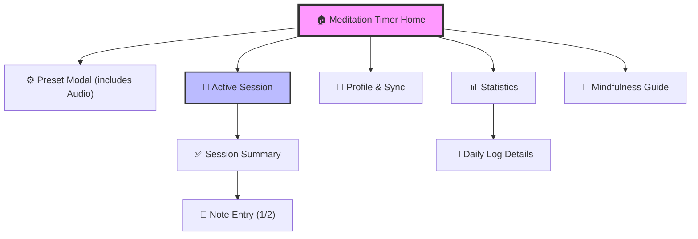

# Meditation App Storyboard

이 문서는 `stitch` 폴더의 구조를 바탕으로 구상된 명상 앱의 스토리보드입니다. 이 앱은 사용자의 마음 챙김 상태를 추적하고, 맞춤형 명상 세션을 제공하며, 세션 후 성찰을 기록하는 데 중점을 둡니다.

## 1. 앱 구조 개요 (Information Architecture)

### 1.1. 화면 맵 (Screen Map)

---

## 2. 화면별 상세 명세 및 레퍼런스

### 2.1. 홈 및 설정 (Home & Configuration)

#### [Screen: Meditation Timer Home]
- **레퍼런스**: [화면 이미지](../stitch/meditation_timer_home/screen.png) | [HTML 코드](../stitch/meditation_timer_home/code.html)
- **목적**: 앱의 메인 진입점으로, 명상을 즉시 시작할 수 있는 환경 제공.
- **주요 기능**:
    - 중앙에 위치한 대형 원형 타이머.
    - 현재 설정된 시간 및 프리셋 표시.
    - '시작' 버튼 및 프리셋 변경 버튼.

#### [Modal: Preset Configuration Modal]
- **레퍼런스**: [화면 이미지](../stitch/preset_configuration_modal/screen.png) | [HTML 코드](../stitch/preset_configuration_modal/code.html)
- **목적**: 명상 세션의 시간, 목표, 배경음을 빠르게 선택.
- **주요 기능**:
    - 사전에 저장된 명상 모드(예: 집중, 휴식, 수면) 리스트.
    - 슬라이더를 이용한 시간 조절.

#### [Screen: Audio Customization Settings]
- **레퍼런스**: [화면 이미지](../stitch/audio_customization_settings/screen.png) | [HTML 코드](../stitch/audio_customization_settings/code.html)
- **목적**: 세션 중 배경에 깔릴 엠비언트 사운드 믹싱.
- **주요 기능**:
    - 빗소리, 파도소리, 백색 소음 등 다양한 소리 라이브러리.
    - 각 사운드별 개별 볼륨 조절.

---

### 2.2. 세션 진행 (Session Experience)

#### [Screen: Active Meditation Session]
- **레퍼런스**: [화면 이미지](../stitch/active_meditation_session/screen.png) | [HTML 코드](../stitch/active_meditation_session/code.html)
- **목적**: 몰입감 있는 명상 환경 제공.
- **주요 기능**:
    - 인터페이스 최소화 (몰입 방해 방지).
    - 부드러운 애니메이션(예: 호흡 가이드 원형).
    - 진행 시간 및 남은 시간 표시.
    - 일시정지 및 종료 옵션.

#### [Screen: Session Complete Summary]
- **레퍼런스**: [화면 이미지](../stitch/session_complete_summary/screen.png) | [HTML 코드](../stitch/session_complete_summary/code.html)
- **목적**: 세션 종료 후 달성감을 제공하고 결과를 요약.
- **주요 기능**:
    - 완료된 총 시간 표시.
    - 연속 명상 일수(Streak) 표시.
    - 현재의 기분을 묻는 간단한 선택지.

---

### 2.3. 기록 및 통계 (Journaling & Insights)

#### [Screen: Meditation Note Entry (1 & 2)]
- **레퍼런스 (1)**: [화면 이미지](../stitch/meditation_note_entry_1/screen.png) | [HTML 코드](../stitch/meditation_note_entry_1/code.html)
- **레퍼런스 (2)**: [화면 이미지](../stitch/meditation_note_entry_2/screen.png) | [HTML 코드](../stitch/meditation_note_entry_2/code.html)
- **목적**: 명상 후 떠오른 생각이나 느낌을 텍스트로 기록.
- **주요 기능**:
    - 자유 형식의 텍스트 입력창.
    - 감사한 일, 관찰한 감정 등에 대한 체크리스트 또는 태그.
    - 감정 상태를 나타내는 이코노그래피 선택.

#### [Screen: Daily Meditation Log Details]
- **레퍼런스**: [화면 이미지](../stitch/daily_meditation_log_details/screen.png) | [HTML 코드](../stitch/daily_meditation_log_details/code.html)
- **목적**: 특정 날짜의 명상 기록을 상세히 확인.
- **주요 기능**:
    - 해당 날짜에 작성한 노트 내용.
    - 수행한 세션의 종류 및 시간 기록.

#### [Screen: Meditation Statistics]
- **레퍼런스**: [화면 이미지](../stitch/meditation_statistics/screen.png) | [HTML 코드](../stitch/meditation_statistics/code.html)
- **목적**: 장기적인 명상 습관 변화를 시각화.
- **주요 기능**:
    - 주간/월간 명상 시간 그래프.
    - 가장 자주 사용한 오디오 프리셋 및 명상 테마.
    - 총 누적 명상 시간 및 세션 횟수.

---

### 2.4. 교육 (Education)

#### [Screen: Mindfulness Guide]
- **레퍼런스**: [화면 이미지](../stitch/mindfulness_guide/screen.png) | [HTML 코드](../stitch/mindfulness_guide/code.html)
- **목적**: 명상 초보자를 위한 단계별 가이드 및 팁 제공.
- **주요 기능**:
    - 올바른 호흡법, 자세 가이드.
    - 명상의 과학적 효과에 대한 짧은 글.

---

## 3. 사용자 여정 (User Journey Example)

1. **시작**: 사용자가 `Meditation Timer Home`을 켬.
2. **커스텀**: `Preset Configuration`에서 15분을 선택하고, `Audio Customization`에서 빗소리를 강화함.
3. **몰입**: `Active Meditation Session` 화면을 보며 명상 수행.
4. **성찰**: 세션 종료 후 `Session Complete Summary`를 확인하고 `Meditation Note Entry`에 짧은 소감을 남김.
5. **확인**: 일주일 후 `Meditation Statistics`를 통해 자신의 명상 루틴이 꾸준했음을 확인.
